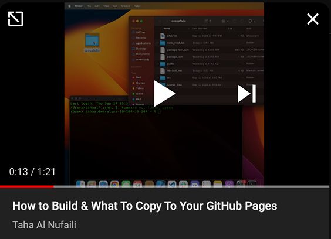

# Hosting Guide for CasuaFolio

## What is Hosting and Why Do I Need It?

Hosting is the process of making your website accessible over the internet by storing its files on a web server. This makes it accessible to anyone around the world, 24/7. The reason you need hosting is to make your portfolio website available to anyone on the internet, rather than just being a project on your local computer.

## Steps to Host Your Site

### Step 1: **Prepare for Hosting**
1. Navigate to your CasuaFolio project folder in your terminal. The folder should be named `casuafolio` or `casuafolio-main`.
2. Once inside the project folder, run `npm run build` to create a `build` directory. For a video tutorial on this step and the next, see the section below.

### Step 2: **Copy Build Contents**
- Copy the contents of the `build` folder.

##### Video Tutorial for Steps 1 and 2

  

### Step 3: Hosting (Publishing it Online)

- **Recommended Service**: [GitHub Pages](https://pages.github.com/)
  - **Why**: Easy setup and it's free.
- **Basic How-To Video**: Follow the steps here [Host a static website for FREE on GitHub](https://youtu.be/M5mg0r4ajt4?si=FFnGEqH276vJcpDV).
- **Clarifying Steps**: At minute 5:00 of this video, the commentator copies & pastes the website files. For additional clarification on what to copy to GitHub Pages (for CasuaFolio), refer to the 1-minute video above.

>Note: If you do not want to use GitHub Pages, many hosting services offer free options specifically designed for static websites. For more information, check out this [list of top 10 free static website hosting providers](https://blog.back4app.com/top-10-free-static-website-hosting-providers/). Getting your portfolio online is easier than you might think!

## Congratulations, You're Done!

You've successfully completed the steps to host your CasuaFolio project online! Your portfolio is now accessible to the world. Great job!
